# DiaryGo — Sistema de Contratação de Diaristas

> **Modelo:** Intermediado — a plataforma define preço, calcula horas, agenda e designa a profissional.
> **Fase atual:** MVP sem pagamento online. Acerto financeiro direto entre cliente e profissional.
> **Base legal:** LC 150/2015

---

## Sumário

1. [Visão Geral](#1-visão-geral)
2. [Atores do Sistema](#2-atores-do-sistema)
3. [Cadastro e Credenciamento](#3-cadastro-e-credenciamento)
4. [Tipos de Serviço](#4-tipos-de-serviço)
5. [Serviços Opcionais](#5-serviços-opcionais-add-ons)
6. [Fluxo de Contratação](#6-fluxo-de-contratação)
7. [Precificação](#7-precificação)
8. [Frequência e Agendamento](#8-frequência-e-agendamento)
9. [Pagamento — Arquitetura Preparada](#9-pagamento--arquitetura-preparada-para-implementação-gradual)
10. [Avaliação e Reputação](#10-avaliação-e-reputação)
11. [Regras Legais e Trabalhistas](#11-regras-legais-e-trabalhistas-crítico)
12. [Escopo Padrão de Tarefas](#12-escopo-padrão-de-tarefas-por-cômodo)
13. [Materiais e Produtos](#13-materiais-e-produtos-de-limpeza)
14. [Comunicação e Notificações](#14-comunicação-e-notificações)
15. [Funcionalidades por Fase](#15-funcionalidades-por-fase)
16. [Regras de Negócio — Checklist](#16-regras-de-negócio--checklist-resumido)
17. [Esquema do Banco de Dados](#17-esquema-do-banco-de-dados)
18. [Stack e Estrutura do Projeto](#18-stack-e-estrutura-do-projeto)

---

## 1. Visão Geral

A plataforma atua como **intermediadora** entre cliente e profissional. O sistema define o preço, calcula horas, agenda o serviço e designa a diarista mais adequada por geolocalização e avaliação. A profissional não negocia diretamente com o cliente — tudo passa pela plataforma.

**Monetização futura:** comissão de ~15% sobre cada serviço intermediado, cobrada após implementação do módulo de pagamento.

---

## 2. Atores do Sistema

- **Cliente (Contratante):** pessoa física ou jurídica que precisa de serviço de limpeza residencial ou comercial.
- **Profissional (Diarista):** trabalhadora autônoma, sem vínculo empregatício, cadastrada e credenciada. Atua como prestadora de serviço pessoa física — MEI não é obrigatório.
- **Plataforma:** o sistema que conecta, gerencia e intermedia a relação entre cliente e profissional.

---

## 3. Cadastro e Credenciamento

### 3.1 Cadastro do Cliente
- Nome completo, e-mail, telefone/celular, CPF (validado), endereço com CEP, senha
- *(Futuro: forma de pagamento — cartão, Pix)*

### 3.2 Cadastro da Profissional
- Nome completo, CPF, RG, telefone, e-mail, foto do rosto
- Endereço e regiões de atuação preferencial
- Documentos obrigatórios: RG (frente e verso), comprovante de residência
- Referências de trabalho: mínimo 2 contatos (nome + telefone)
- Categorias de serviço em que deseja atuar
- Dados bancários/Pix — opcional no MVP, obrigatório quando o módulo de pagamento for ativado

### 3.3 Processo de Aprovação (Automatizado, 100% digital)
1. Profissional preenche cadastro e envia documentos
2. Sistema valida CPF e verifica legibilidade dos documentos
3. Equipe analisa documentos e referências em até 48h úteis
4. Validação de referências por SMS/WhatsApp automatizado
5. Aprovação ou reprovação com notificação por e-mail/push
6. Profissional aprovada já recebe solicitações imediatamente

**Critérios de reprovação automática:** CPF irregular, documentos ilegíveis, referências não confirmadas.

**Rechecagem:** a cada 6 meses o sistema solicita atualização de documentos.

---

## 4. Tipos de Serviço

| Tipo | Descrição | Duração mínima |
|---|---|---|
| Limpeza Padrão | Faxina de rotina — varrer, passar pano, tirar pó, limpar cozinha e banheiros | 4h |
| Limpeza Pesada | Limpeza profunda com mais tempo e detalhamento | 6h |
| Limpeza Pós-Obra | Remoção de resíduos de reforma (cimento, tinta, poeira grossa) | 8h |
| Limpeza Pré-Mudança | Preparar o imóvel para entrada — lavagem de azulejos, rodapés, portas | 6h |
| Limpeza Comercial | Escritórios e salas comerciais | 4h |
| Limpeza Express | Serviço rápido de manutenção leve | 1h30 |
| Passadoria | Passar roupas — cobrado por horas ou por número de peças | 2h |

---

## 5. Serviços Opcionais (Add-ons)

| Add-on | Valor extra | Tempo extra |
|---|---|---|
| Limpeza interna de geladeira | R$ 25,00 | +30 min |
| Limpeza interna de armários | R$ 30,00 | +45 min |
| Aspiração de tapetes/estofados | R$ 35,00 | +45 min |
| Limpeza de janelas internas | R$ 20,00 | +30 min |
| Lavagem de roupas | R$ 15,00 | +30 min |
| Passadoria (2h) | R$ 40,00 | +120 min |
| Limpeza de área externa | R$ 25,00 | +45 min |

---

## 6. Fluxo de Contratação

### 6.1 Solicitação pelo Cliente
1. Cliente seleciona tipo de serviço e informa dados do imóvel (cômodos)
2. Sistema calcula horas estimadas e adiciona opcionais escolhidos
3. Cliente escolhe data, horário e frequência
4. Sistema exibe **valor estimado** e duração prevista
5. Cliente confirma — sem cobrança online no MVP

### 6.2 Atribuição da Profissional
1. Sistema busca profissionais disponíveis na região (por CEP/bairro)
2. Prioriza por melhor avaliação (nota mínima configurável, ex.: 4.6/5.0) e proximidade
3. Profissional recebe a solicitação e tem **30 minutos** para aceitar ou recusar
4. Se recusar ou não responder, redireciona para a próxima do ranking
5. Na véspera, cliente recebe nome, foto e RG da profissional designada

### 6.3 Execução do Serviço
1. Profissional faz **check-in** ao chegar (botão no app + geolocalização)
2. Executa as tarefas conforme o escopo contratado
3. Profissional faz **check-out** ao finalizar
4. Cliente recebe notificação de conclusão

### 6.4 Pagamento (MVP — sem cobrança online)
1. Valor exibido como **referência** na confirmação
2. Acerto financeiro diretamente entre cliente e profissional (dinheiro, Pix pessoal)
3. Sistema registra o valor de referência no histórico
4. Ambas as partes confirmam a conclusão no app

### 6.5 Pós-Serviço
1. Cliente avalia a profissional (nota + comentário + critérios)
2. Profissional avalia o cliente (ambiente, materiais, respeito — visível só para a plataforma)
3. Sistema oferece opção de agendar próxima limpeza ou criar recorrência

---

## 7. Precificação

### 7.1 Fatores que Influenciam o Preço
- Localização / cidade / região
- Tipo de serviço e número de cômodos
- Serviços opcionais selecionados
- Frequência (única, semanal, quinzenal, 2x/semana)

### 7.2 Regras de Precificação
- Valor base calculado por hora conforme tabela da plataforma por região
- Descontos por frequência: 2x/semana = 15%, semanal = 10%, quinzenal = 5%
- Acréscimo configurável para fins de semana e feriados
- Preço exibido como **valor de referência** antes da confirmação

### 7.3 Modelo de Receita (Futuro)
- Comissão de ~15% sobre o valor pago pelo cliente
- Planos premium para profissionais (destaque no ranking)
- Assistência residencial por assinatura

---

## 8. Frequência e Agendamento

| Frequência | Descrição |
|---|---|
| Única | Serviço avulso, sem recorrência |
| Semanal | Mesmo dia/horário toda semana |
| 2x por semana | Dois dias fixos por semana |
| Quinzenal | A cada 14 dias |

**Regras:**
- Agendamento com mínimo **24h de antecedência**
- Reagendamento gratuito com mais de 24h de antecedência
- Cancelamento/reagendamento com menos de 24h: **penalização no score** do cliente
- Recorrências podem ser pausadas ou canceladas a qualquer momento

---

## 9. Pagamento — Arquitetura Preparada para Implementação Gradual

### O que já existe no MVP
- Tabela de preços por região, tipo de serviço e opcionais
- Cálculo automático do valor de referência
- Registro do valor no histórico de cada serviço
- Campos de dados bancários/Pix no cadastro da profissional (opcionais)
- Estrutura de dados para transações financeiras (tabela `transacoes`)
- Endpoints/interfaces preparados mas desativados para gateway de pagamento

### Roadmap de Pagamento

| Fase | Descrição |
|---|---|
| **Fase 1 — MVP** | Sem cobrança online. Valor como referência. Confirmação manual. |
| **Fase 2 — Básico** | Gateway (Stripe/Mercado Pago/Asaas), cartão/Pix, escrow até conclusão, repasse automático. |
| **Fase 3 — Avançado** | Parcelamento, boleto, carteira digital, antecipação de recebíveis, recorrência automática. |
| **Fase 4 — Completo** | Painel financeiro, emissão de recibos, integração contábil, cashback, multas automáticas. |

---

## 10. Avaliação e Reputação

- Cliente avalia profissional após cada serviço: nota 1–5 + comentário + critérios (pontualidade, qualidade, educação)
- Profissional avalia cliente: ambiente, materiais, respeito — **visível apenas para a plataforma**
- Nota < 4.0: **alerta automático** para a profissional
- Nota < 3.5 por 3 serviços consecutivos: **suspensão temporária**
- Reincidência após suspensão: descredenciamento
- Avaliações do cliente são públicas no perfil da profissional
- Clientes com histórico ruim têm score reduzido

---

## 11. Regras Legais e Trabalhistas (CRÍTICO)

### LC 150/2015 — Diarista vs. Empregada Doméstica

- **Diarista (autônoma):** até 2 dias/semana para o mesmo contratante → sem vínculo empregatício
- **Empregada doméstica:** 3+ dias/semana → vínculo CLT obrigatório (carteira, férias, 13º, FGTS, INSS)

### Implicações para o Sistema
- **LIMITE MÁXIMO:** 2 visitas/semana da mesma profissional no mesmo endereço
- Sistema **DEVE bloquear** tentativas de agendar 3+ vezes/semana com a mesma profissional
- Se cliente precisar de 3+ dias/semana, o sistema **rotaciona profissionais** automaticamente
- View `vw_servicos_por_semana` controla esse limite

### Formalização da Profissional
- MEI **não é obrigatório** — CPF como prestador autônomo é suficiente
- Profissional é responsável pela própria contribuição ao INSS
- MEI no perfil é diferencial (selo), não exigência

### Recomendações de Proteção
- Pagamentos por diária, nunca como salário mensal fixo
- Profissional organiza seus próprios horários e escolhe quais serviços aceitar
- Profissional deve atender múltiplos clientes (sem exclusividade)
- Termo de adesão entre plataforma e profissional (não é contrato de trabalho)

---

## 12. Escopo Padrão de Tarefas por Cômodo

**Todos os cômodos:** remover pó, esvaziar lixeiras, varrer e passar pano, recolher roupas, limpar embaixo de móveis leves.

**Cozinha:** higienizar pia, lavar louça, limpar fogão e área externa do forno, exterior de armários e eletrodomésticos.

**Banheiros:** higienizar vaso, pia e box, limpar espelhos e superfícies.

**Quartos:** arrumar camas, tirar pó de móveis e eletrônicos, organizar roupas expostas.

**Finalização:** lavar panos usados, organizar utensílios e produtos de limpeza.

**NÃO incluído por padrão:** limpeza externa de janelas, subir em escadas altas, áreas externas, interior de geladeira/armários, lavagem/passadoria de roupas (requerem add-on).

---

## 13. Materiais e Produtos de Limpeza

- **Regra padrão:** materiais fornecidos pelo contratante (cliente)
- **Exceção:** limpezas pós-obra e pré-mudança (profissional pode levar seus próprios produtos)
- **Lista mínima sugerida:** vassoura, rodo, balde, pano de chão, esponja, detergente, desinfetante, água sanitária, limpa-vidros

---

## 14. Comunicação e Notificações

| Momento | Canal | Destinatário |
|---|---|---|
| Pedido confirmado | E-mail + push | Cliente e profissional |
| Véspera do serviço | Push | Cliente (com nome, foto e RG da profissional) |
| Check-in da profissional | Push | Cliente |
| Serviço concluído | Push + e-mail | Ambos (pedido de avaliação) |
| Reagendamento | Push | Ambos |
| Cancelamento | Push | Ambos (com info de penalizações) |
| Lembrete de recorrência | Push | Cliente |

---

## 15. Funcionalidades por Fase

### Fase 1 — MVP (atual)
**Cliente:** cadastro/login, solicitação com cálculo automático, confirmação sem pagamento, acompanhamento, avaliação, histórico, reagendamento e cancelamento.

**Profissional:** cadastro com documentos, recebimento de solicitações por geo, aceite/recusa, agenda, check-in/out, perfil com avaliações.

**Admin:** aprovação/suspensão de profissionais, gestão de clientes, visão de serviços, configuração de preços por região.

### Fase 2 — Pagamento Online
Gateway de pagamento, cobrança no app (cartão/Pix), escrow até conclusão, repasse automático com comissão, painel financeiro básico.

### Fase 3 — Crescimento
Chat in-app, programa de indicação, planos premium para profissionais, multas automáticas, garantia de satisfação com reembolso.

### Fase 4 — Escala
Assistência residencial por assinatura, parcerias com condomínios, programa de fidelidade, antecipação de recebíveis, integração contábil, expansão de tipos de serviço.

---

## 16. Regras de Negócio — Checklist Resumido

1. ✅ Aprovação por validação documental automatizada (sem entrevista)
2. ✅ MEI não obrigatório — CPF como prestador autônomo é suficiente
3. ✅ Cliente recebe valor de referência transparente antes de confirmar
4. ✅ MVP sem cobrança online — estrutura preparada para pagamento futuro
5. ✅ **Limite de 2 visitas/semana** da mesma profissional no mesmo endereço (LC 150/2015)
6. ✅ Avaliação mútua após cada serviço
7. ✅ Nota < 4.0 = alerta; nota < 3.5 por 3 serviços consecutivos = suspensão
8. ✅ Cancelamento < 24h = penalização no score
9. ✅ Dados da profissional enviados ao cliente na véspera (segurança)
10. ✅ Sem vínculo empregatício entre plataforma e profissional
11. ✅ Profissional escolhe regiões, horários e quais serviços aceitar (autonomia)
12. ✅ Sistema rotaciona profissionais se cliente solicitar 3+ dias/semana
13. ✅ Descontos por recorrência previstos na tabela de preços
14. ✅ Roadmap claro de 4 fases para evolução gradual

---

## 17. Esquema do Banco de Dados

**SGBD:** PostgreSQL 14+ | **Migrações:** Flyway

### Diagrama Entidade-Relacionamento

```mermaid
erDiagram
    %% ===================== CORE =====================
    USUARIOS {
        UUID id PK
        VARCHAR email UK
        VARCHAR senha_hash
        ENUM tipo "CLIENTE | PROFISSIONAL | ADMIN"
        BOOLEAN email_verificado
        BOOLEAN ativo
        TIMESTAMPTZ criado_em
        TIMESTAMPTZ atualizado_em
    }

    CLIENTES {
        UUID id PK
        UUID usuario_id FK, UK
        VARCHAR nome
        CHAR cpf UK
        VARCHAR telefone
        SMALLINT score "0-100, default 100"
        TIMESTAMPTZ criado_em
        TIMESTAMPTZ atualizado_em
    }

    PROFISSIONAIS {
        UUID id PK
        UUID usuario_id FK, UK
        VARCHAR nome
        CHAR cpf UK
        VARCHAR rg
        VARCHAR telefone
        VARCHAR foto_url
        ENUM status "PENDENTE | APROVADA | REPROVADA | SUSPENSA | DESCREDENCIADA"
        NUMERIC nota_media "1.00-5.00"
        INTEGER total_servicos
        BOOLEAN mei
        TIMESTAMPTZ criado_em
        TIMESTAMPTZ atualizado_em
    }

    ADMINS {
        UUID id PK
        UUID usuario_id FK, UK
        VARCHAR nome
        JSONB permissoes
        TIMESTAMPTZ criado_em
        TIMESTAMPTZ atualizado_em
    }

    %% ===================== DOCUMENTOS E REFERENCIAS =====================
    DOCUMENTOS {
        UUID id PK
        UUID profissional_id FK
        ENUM tipo "RG_FRENTE | RG_VERSO | CPF | COMPROVANTE | FOTO | OUTRO"
        VARCHAR url
        ENUM status "PENDENTE | APROVADO | REPROVADO"
        UUID analisado_por FK
        TEXT observacao
        TIMESTAMPTZ criado_em
        TIMESTAMPTZ atualizado_em
    }

    REFERENCIAS {
        UUID id PK
        UUID profissional_id FK
        VARCHAR nome_contato
        VARCHAR telefone_contato
        ENUM status "PENDENTE | CONFIRMADA | NAO_CONFIRMADA"
        TIMESTAMPTZ criado_em
        TIMESTAMPTZ atualizado_em
    }

    %% ===================== REGIOES E DISPONIBILIDADE =====================
    REGIOES {
        UUID id PK
        VARCHAR nome
        VARCHAR cidade
        CHAR estado
        CHAR cep_inicio
        CHAR cep_fim
        BOOLEAN ativa
        TIMESTAMPTZ criado_em
        TIMESTAMPTZ atualizado_em
    }

    REGIOES_ATUACAO {
        UUID profissional_id PK, FK
        UUID regiao_id PK, FK
    }

    DISPONIBILIDADES {
        UUID id PK
        UUID profissional_id FK
        SMALLINT dia_semana "0=Dom 6=Sab"
        TIME hora_inicio
        TIME hora_fim
        TIMESTAMPTZ criado_em
    }

    %% ===================== CATALOGO =====================
    CATEGORIAS_SERVICO {
        UUID id PK
        VARCHAR nome UK
        TEXT descricao
        INTEGER duracao_minima_min
        BOOLEAN ativa
        TIMESTAMPTZ criado_em
        TIMESTAMPTZ atualizado_em
    }

    CATEGORIAS_PROFISSIONAL {
        UUID profissional_id PK, FK
        UUID categoria_id PK, FK
    }

    OPCIONAIS {
        UUID id PK
        VARCHAR nome UK
        TEXT descricao
        NUMERIC valor_extra
        INTEGER tempo_extra_min
        BOOLEAN ativo
        TIMESTAMPTZ criado_em
        TIMESTAMPTZ atualizado_em
    }

    TABELA_PRECOS {
        UUID id PK
        UUID categoria_id FK
        UUID regiao_id FK
        NUMERIC preco_hora
        NUMERIC acrescimo_fds
        NUMERIC desconto_semanal
        NUMERIC desconto_quinzenal
        NUMERIC desconto_duas_semana
        BOOLEAN ativa
        TIMESTAMPTZ criado_em
        TIMESTAMPTZ atualizado_em
    }

    %% ===================== ENDERECOS =====================
    ENDERECOS {
        UUID id PK
        UUID cliente_id FK
        VARCHAR logradouro
        VARCHAR numero
        VARCHAR complemento
        VARCHAR bairro
        VARCHAR cidade
        CHAR estado
        CHAR cep
        NUMERIC lat
        NUMERIC lon
        BOOLEAN principal
        SMALLINT num_quartos
        SMALLINT num_banheiros
        SMALLINT num_salas
        SMALLINT num_cozinhas
        NUMERIC area_m2
        TIMESTAMPTZ criado_em
        TIMESTAMPTZ atualizado_em
    }

    %% ===================== DADOS BANCARIOS =====================
    DADOS_BANCARIOS {
        UUID id PK
        UUID profissional_id FK
        VARCHAR banco
        VARCHAR agencia
        VARCHAR conta
        VARCHAR tipo_conta
        VARCHAR chave_pix
        BOOLEAN principal
        TIMESTAMPTZ criado_em
        TIMESTAMPTZ atualizado_em
    }

    %% ===================== SOLICITACOES =====================
    SOLICITACOES {
        UUID id PK
        UUID cliente_id FK
        UUID endereco_id FK
        UUID categoria_id FK
        ENUM frequencia "UNICA | SEMANAL | DUAS_POR_SEMANA | QUINZENAL"
        DATE data_servico
        TIME hora_inicio
        INTEGER duracao_estimada_min
        NUMERIC valor_referencia
        TEXT observacoes
        ENUM status "AGUARDANDO | ATRIBUIDA | CONFIRMADA | EM_ANDAMENTO | CONCLUIDA | CANCELADA"
        TIMESTAMPTZ criado_em
        TIMESTAMPTZ atualizado_em
    }

    SOLICITACAO_OPCIONAIS {
        UUID solicitacao_id PK, FK
        UUID opcional_id PK, FK
    }

    %% ===================== RECORRENCIAS =====================
    RECORRENCIAS {
        UUID id PK
        UUID solicitacao_origem_id FK
        UUID cliente_id FK
        ENUM frequencia "SEMANAL | DUAS_POR_SEMANA | QUINZENAL"
        SMALLINT dia_semana_1
        SMALLINT dia_semana_2
        TIME hora_inicio
        ENUM status "ATIVA | PAUSADA | CANCELADA"
        DATE proxima_data
        TIMESTAMPTZ criado_em
        TIMESTAMPTZ atualizado_em
    }

    %% ===================== SERVICOS (execucao) =====================
    SERVICOS {
        UUID id PK
        UUID solicitacao_id FK, UK
        UUID profissional_id FK
        UUID recorrencia_id FK
        ENUM status "AGENDADO | EM_ANDAMENTO | CONCLUIDO | CANCELADO | NO_SHOW"
        TIMESTAMPTZ checkin_em
        NUMERIC checkin_lat
        NUMERIC checkin_lon
        TIMESTAMPTZ checkout_em
        NUMERIC checkout_lat
        NUMERIC checkout_lon
        BOOLEAN confirmado_cliente
        BOOLEAN confirmado_prof
        TIMESTAMPTZ criado_em
        TIMESTAMPTZ atualizado_em
    }

    HISTORICO_STATUS {
        UUID id PK
        UUID servico_id FK
        ENUM status_anterior
        ENUM status_novo
        TEXT observacao
        TIMESTAMPTZ criado_em
    }

    %% ===================== AVALIACOES =====================
    AVALIACOES_CLIENTE {
        UUID id PK
        UUID servico_id FK, UK
        UUID cliente_id FK
        UUID profissional_id FK
        SMALLINT nota "1-5"
        TEXT comentario
        SMALLINT pontualidade "1-5"
        SMALLINT qualidade "1-5"
        SMALLINT educacao "1-5"
        TIMESTAMPTZ criado_em
    }

    AVALIACOES_PROFISSIONAL {
        UUID id PK
        UUID servico_id FK, UK
        UUID profissional_id FK
        UUID cliente_id FK
        SMALLINT nota "1-5"
        SMALLINT ambiente "1-5"
        SMALLINT materiais "1-5"
        SMALLINT respeito "1-5"
        TIMESTAMPTZ criado_em
    }

    %% ===================== FINANCEIRO =====================
    TRANSACOES {
        UUID id PK
        UUID servico_id FK, UK
        UUID cliente_id FK
        UUID profissional_id FK
        NUMERIC valor
        ENUM metodo "DIRETO_EXTERNO | CARTAO | PIX | BOLETO"
        ENUM status "REGISTRADA | PENDENTE | PAGA | ESTORNADA"
        VARCHAR referencia_ext
        TIMESTAMPTZ criado_em
        TIMESTAMPTZ atualizado_em
    }

    %% ===================== NOTIFICACOES =====================
    NOTIFICACOES {
        UUID id PK
        UUID usuario_id FK
        ENUM canal "PUSH | EMAIL | SMS | IN_APP"
        VARCHAR titulo
        TEXT corpo
        ENUM status "PENDENTE | ENVIADA | FALHOU | LIDA"
        BOOLEAN lida
        TIMESTAMPTZ criado_em
        TIMESTAMPTZ atualizado_em
    }

    %% ===================== RELACIONAMENTOS =====================

    %% Core: Usuario -> Perfis (1:1)
    USUARIOS ||--o| CLIENTES : "e um"
    USUARIOS ||--o| PROFISSIONAIS : "e um"
    USUARIOS ||--o| ADMINS : "e um"

    %% Cliente -> Enderecos (1:N)
    CLIENTES ||--o{ ENDERECOS : "possui"

    %% Profissional -> Documentos, Referencias, Dados Bancarios (1:N)
    PROFISSIONAIS ||--o{ DOCUMENTOS : "envia"
    PROFISSIONAIS ||--o{ REFERENCIAS : "fornece"
    PROFISSIONAIS ||--o{ DADOS_BANCARIOS : "cadastra"
    PROFISSIONAIS ||--o{ DISPONIBILIDADES : "define"

    %% Admin analisa documentos
    ADMINS ||--o{ DOCUMENTOS : "analisa"

    %% N:N Profissional <-> Regioes (via tabela associativa)
    PROFISSIONAIS ||--o{ REGIOES_ATUACAO : "atua em"
    REGIOES ||--o{ REGIOES_ATUACAO : "atendida por"

    %% N:N Profissional <-> Categorias (via tabela associativa)
    PROFISSIONAIS ||--o{ CATEGORIAS_PROFISSIONAL : "oferece"
    CATEGORIAS_SERVICO ||--o{ CATEGORIAS_PROFISSIONAL : "exercida por"

    %% Catalogo: Tabela de Precos = Categoria x Regiao
    CATEGORIAS_SERVICO ||--o{ TABELA_PRECOS : "precificada em"
    REGIOES ||--o{ TABELA_PRECOS : "tem preco para"

    %% Solicitacao
    CLIENTES ||--o{ SOLICITACOES : "solicita"
    ENDERECOS ||--o{ SOLICITACOES : "local de"
    CATEGORIAS_SERVICO ||--o{ SOLICITACOES : "tipo de"

    %% N:N Solicitacao <-> Opcionais
    SOLICITACOES ||--o{ SOLICITACAO_OPCIONAIS : "inclui"
    OPCIONAIS ||--o{ SOLICITACAO_OPCIONAIS : "adicionado em"

    %% Recorrencia
    SOLICITACOES ||--o| RECORRENCIAS : "origina"
    CLIENTES ||--o{ RECORRENCIAS : "mantem"

    %% Servico (execucao)
    SOLICITACOES ||--o| SERVICOS : "gera"
    PROFISSIONAIS ||--o{ SERVICOS : "executa"
    RECORRENCIAS ||--o{ SERVICOS : "agenda"

    %% Historico de status do servico
    SERVICOS ||--o{ HISTORICO_STATUS : "registra"

    %% Avaliacoes (1:1 por servico)
    SERVICOS ||--o| AVALIACOES_CLIENTE : "avaliado por cliente"
    SERVICOS ||--o| AVALIACOES_PROFISSIONAL : "avaliado por profissional"
    CLIENTES ||--o{ AVALIACOES_CLIENTE : "avalia"
    PROFISSIONAIS ||--o{ AVALIACOES_CLIENTE : "recebe avaliacao"
    PROFISSIONAIS ||--o{ AVALIACOES_PROFISSIONAL : "avalia"
    CLIENTES ||--o{ AVALIACOES_PROFISSIONAL : "recebe avaliacao"

    %% Transacoes (1:1 por servico)
    SERVICOS ||--o| TRANSACOES : "gera"
    CLIENTES ||--o{ TRANSACOES : "paga"
    PROFISSIONAIS ||--o{ TRANSACOES : "recebe"

    %% Notificacoes
    USUARIOS ||--o{ NOTIFICACOES : "recebe"
```



### Tabelas — Descrição Resumida

| Tabela | Descrição |
|---|---|
| `usuarios` | Base de autenticação (email, senha_hash, tipo: CLIENTE/PROFISSIONAL/ADMIN) |
| `clientes` | Dados do cliente, CPF, score (0–100) |
| `profissionais` | Dados da diarista, status de credenciamento, nota_media |
| `admins` | Administradores com permissões em JSONB |
| `documentos` | Documentos enviados pela profissional para aprovação |
| `referencias` | Referências profissionais com validação por SMS/WhatsApp |
| `regioes` | Regiões de atendimento por cidade/bairro/faixa de CEP |
| `regioes_atuacao` | N:N — regiões em que cada profissional atende |
| `categorias_servico` | Tipos de serviço (Padrão, Pesada, Pós-Obra, etc.) |
| `categorias_profissional` | N:N — categorias em que cada profissional atua |
| `opcionais` | Add-ons disponíveis (geladeira, tapetes, etc.) com valor e tempo extras |
| `tabela_precos` | Preço por hora por categoria × região, com acréscimos e descontos |
| `enderecos` | Endereços do cliente com lat/lon e características do imóvel |
| `disponibilidades` | Agenda de disponibilidade da profissional (dia da semana + horário) |
| `solicitacoes` | Pedido de serviço feito pelo cliente (antes de ser atribuído) |
| `solicitacao_opcionais` | N:N — add-ons escolhidos em cada solicitação |
| `recorrencias` | Controle de serviços recorrentes (semanal, quinzenal, 2x/semana) |
| `servicos` | Execução efetiva — criado quando profissional aceita, com check-in/out |
| `historico_status` | Auditoria de todas as mudanças de status dos serviços |
| `avaliacoes_cliente` | Avaliação do cliente sobre a profissional (pública, critérios: pontualidade, qualidade, educação) |
| `avaliacoes_profissional` | Avaliação da profissional sobre o cliente (interna, critérios: ambiente, materiais, respeito) |
| `dados_bancarios` | Dados bancários e chave Pix da profissional |
| `transacoes` | Registro financeiro — no MVP apenas referência; estruturado para gateway futuro |
| `notificacoes` | Fila de notificações por canal (PUSH, EMAIL, SMS, IN_APP) |

### View de Controle Legal

```sql
-- Controla o limite LC 150/2015: máximo 2 serviços/semana por profissional/endereço
CREATE VIEW vw_servicos_por_semana AS
SELECT
    s.profissional_id,
    sol.endereco_id,
    sol.cliente_id,
    DATE_TRUNC('week', sol.data_servico) AS semana,
    COUNT(*) AS total_servicos
FROM servicos s
JOIN solicitacoes sol ON sol.id = s.solicitacao_id
WHERE s.status NOT IN ('CANCELADO', 'NO_SHOW_CLIENTE', 'NO_SHOW_PROFISSIONAL')
GROUP BY s.profissional_id, sol.endereco_id, sol.cliente_id, DATE_TRUNC('week', sol.data_servico);
```

### Triggers Automáticos

| Trigger | Ação |
|---|---|
| `trg_*_atualizado` | Atualiza `atualizado_em` automaticamente em 6 tabelas |
| `trg_recalcular_nota` | Recalcula `nota_media` e `total_servicos` da profissional após nova avaliação |

---

## 18. Stack e Estrutura do Projeto

**Stack:** Go · chi · PostgreSQL · Flyway · pgAdmin · Git · Swagger (swaggo/swag)

```
diarygo/
├── cmd/api/            # main.go — entrypoint do servidor HTTP
├── internal/
│   ├── domain/         # Entidades, interfaces de repository e regras de negócio
│   ├── handler/        # Handlers HTTP (chi) com anotações swaggo
│   ├── service/        # Use cases / lógica de aplicação
│   ├── repository/
│   │   ├── memory/     # Implementações in-memory (desenvolvimento e testes unitários)
│   │   └── postgres/   # Implementações PostgreSQL (produção)
│   └── middleware/     # Auth JWT, logging, etc.
├── pkg/                # Código reutilizável e exportável
├── migrations/         # Scripts SQL do Flyway (V1__*, V2__*, etc.)
├── config/             # Configurações e env
├── docs/swagger/       # Gerado pelo swag init — não editar manualmente
├── docker-compose.yml  # PostgreSQL + pgAdmin + Flyway
├── PLANO.md            # Plano de implementação por etapas
└── go.mod
```

**Comandos rápidos:**
```bash
go run cmd/api/main.go      # rodar
go test ./...               # testar
gofmt -w .                  # formatar
go vet ./...                # verificar
docker-compose up -d        # subir infraestrutura
```

---

*Documento atualizado em 12/abril/2026. Modelo intermediado, MVP sem pagamento online, arquitetura preparada para evolução gradual.*
